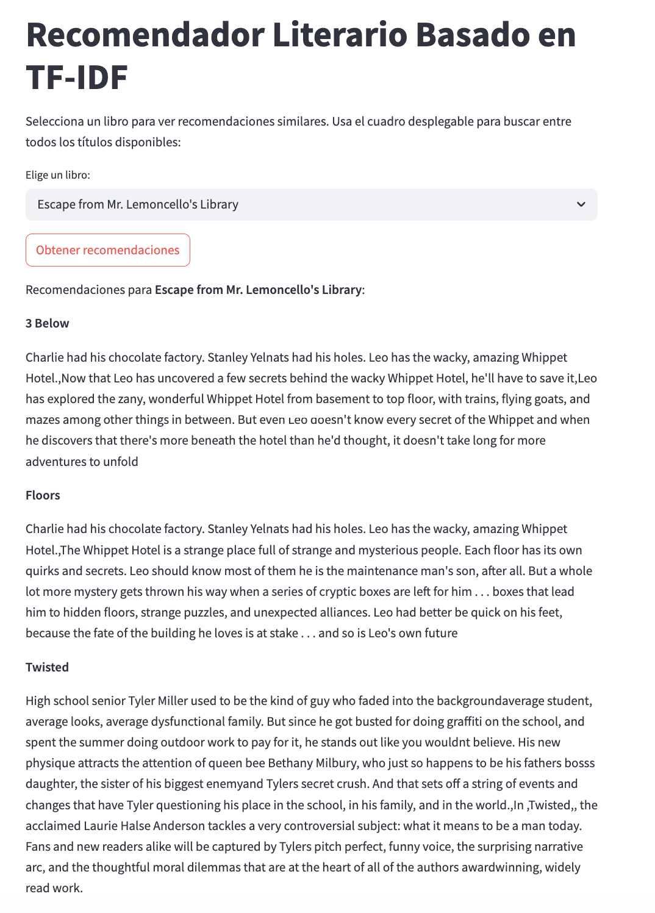
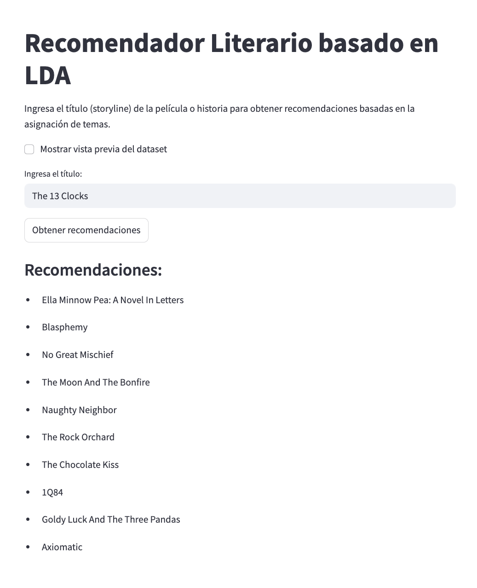
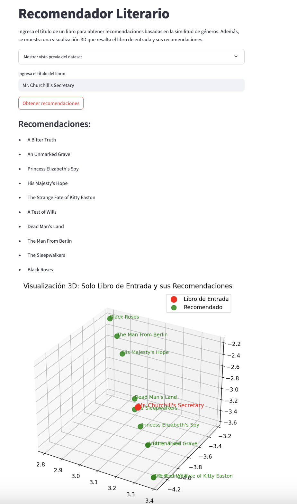
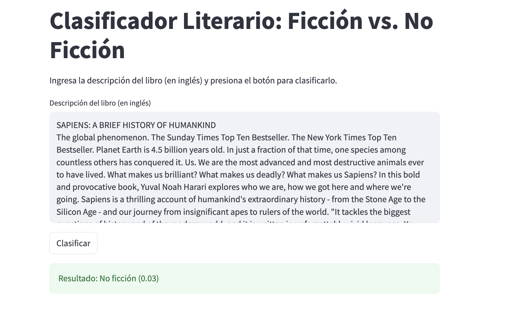
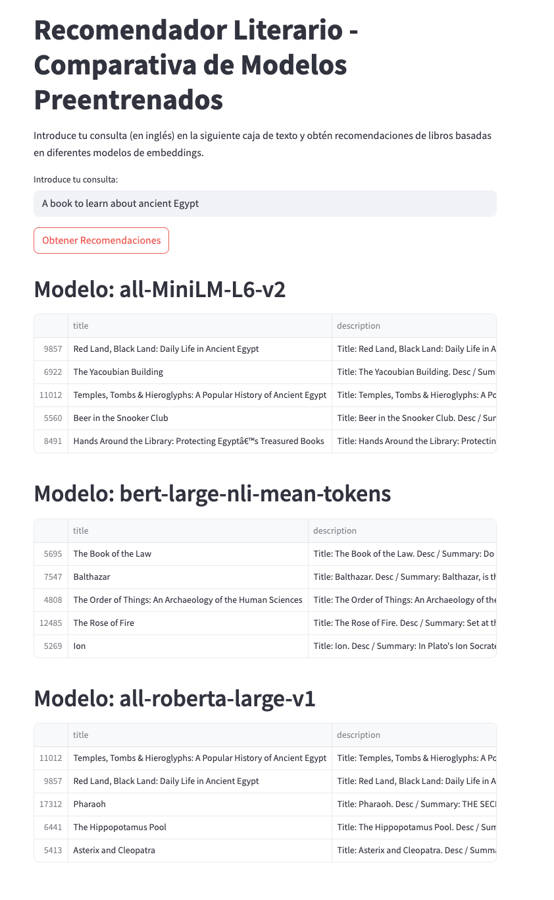
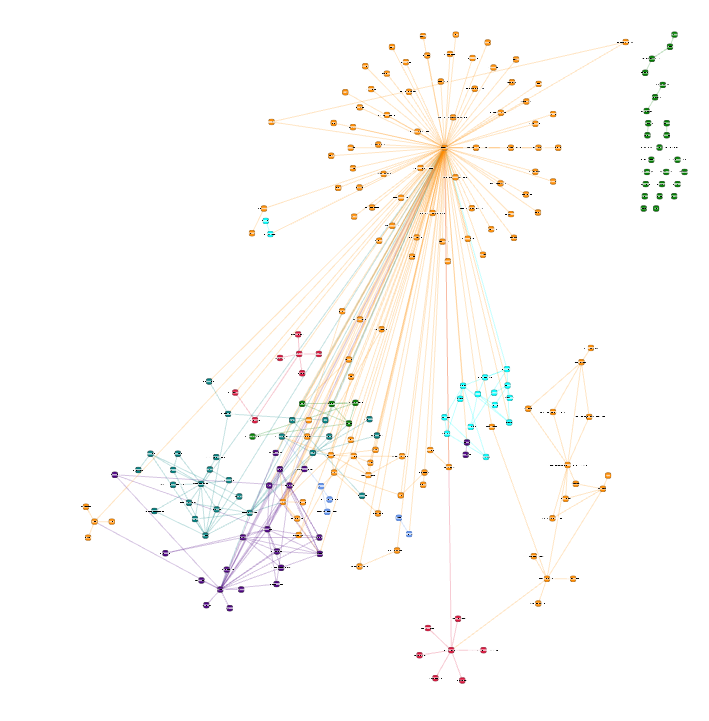

# Bibliophile's Nexus
*De amantes de la literatura para amantes de la literatura*

Bibliophile's Nexus es un proyecto integral que explora el análisis literario desde múltiples perspectivas. Aquí encontrarás herramientas de recomendación, clasificación y visualización de datos aplicadas al mundo de los libros, todo desarrollado con técnicas avanzadas de procesamiento de lenguaje natural y modelado de datos.

---

## Índice

- [Descripción del Proyecto](#descripción-del-proyecto)
  - [1. Análisis Exploratorio de Datos (EDA)](#1-análisis-exploratorio-de-datos-eda)
  - [2. Recomendador Basado en TF-IDF](#2-recomendador-basado-en-tf-idf)
  - [3. Recomendador Basado en LDA](#3-recomendador-basado-en-lda)
  - [4. Recomendador Basado en CountVectorizer](#4-recomendador-basado-en-countvectorizer)
  - [5. Clasificador Basado en LSTM](#5-clasificador-basado-en-lstm)
  - [6. Recomendador con Transformers Preentrenados](#6-recomendador-con-transformers-preentrenados)
  - [7. Visualización de Grafos con GraphRAG](#7-visualización-de-grafos-con-graphrag)
- [Web Apps](#web-apps)
- [Ejemplo de Despliegue de una Web App](#ejemplo-de-despliegue-de-una-web-app)
- [Estudio de Error y Futuras Líneas de Investigación](#estudio-de-error-y-futuras-líneas-de-investigación)
- [Estructura del Proyecto](#estructura-del-proyecto)
- [Requisitos](#requisitos)
- [Autores](#autores)

---

## Descripción del Proyecto

Bibliophile's Nexus nace de la pasión por la literatura y la curiosidad por explorar técnicas avanzadas en análisis de textos. Nuestro objetivo es desarrollar herramientas que permitan:
- **Analizar** la información contenida en grandes datasets de libros.
- **Recomendar** lecturas basadas en similitudes semánticas y temáticas.
- **Clasificar** libros según categorías predefinidas (por ejemplo, ficción vs. no ficción).
- **Visualizar** relaciones y patrones a través de técnicas de grafo.

Cada módulo del proyecto se ha diseñado para abordar un aspecto específico del análisis literario, combinando métodos tradicionales con técnicas de vanguardia en procesamiento de lenguaje natural.


---

<div style="background-color:#ffe6e6; padding: 10px; border: 1px solid #ff0000;">
  <strong style="color:#ff0000;">¡ATENCIÓN!</strong><br><br>
  No hemos podido incluir en el repositorio las carpetas <strong>“datasets”</strong> y <strong>“modelos”</strong> debido a restricciones de tamaño en Git LFS. Estas carpetas, que se encuentran en la raíz del proyecto, contienen archivos grandes que no se pudieron subir. Puedes acceder a ellas mediante los siguientes enlaces:<br><br>
  
  <strong>datasets:</strong> [Acceso a datasets](https://upcomillas-my.sharepoint.com/:f:/r/personal/202413514_alu_comillas_edu/Documents/datasets?csf=1&web=1&e=nM39Yh)<br>
  <strong>modelos:</strong> [Acceso a modelos](https://upcomillas-my.sharepoint.com/:u:/g/personal/202413514_alu_comillas_edu/Ec33eEeFiANMlm10lHKfSMsB9L4cHdAkRFD2uMAf6cZKQw?e=6GnIfS)
</div>

<br>

Además, el proyecto completo —incluyendo las carpetas <strong>“datasets”</strong> y <strong>“modelos”</strong>— se puede descargar desde:<br>
[Descarga completa del proyecto](https://upcomillas-my.sharepoint.com/:u:/g/personal/202413514_alu_comillas_edu/EdMEgEKd_t1NoALzKsKqIGsBfsB8xbFEqQBjBtL-VmJ6eg?e=3VZfBi)

---

### 1. Análisis Exploratorio de Datos (EDA)

En el notebook **`01_EDA.ipynb`** realizamos un exhaustivo Análisis Exploratorio de Datos.  
- **Limpieza y Filtrado:** Eliminamos duplicados, registros incompletos y filtramos aquellos libros con descripciones breves o pocos reviews.
- **Normalización:** Se limpia y estandariza la columna `desc`, generando la columna `clean_description`.
- **Detección de Idioma:** Se utiliza la librería *langdetect* para asegurar que se analicen únicamente textos en inglés.
- **Visualizaciones:** Se exploran estadísticas, distribuciones y relaciones (por ejemplo, top autores, libros con más reseñas, distribución de ratings, etc.).


---

### 2. Recomendador Basado en TF-IDF

El notebook **`02_tf_idf.ipynb`** desarrolla un sistema de recomendación literaria utilizando TF-IDF.  
- **Transformación del Texto:** Se utiliza TF-IDF Vectorizer para convertir las descripciones en vectores que resaltan palabras clave.
- **Similitud Semántica:** Se calcula la similitud coseno para determinar qué libros son temáticamente afines.
- **Incorporación de N-gramas:** La inclusión de n-gramas (rango 1 a 6) mejora la captura de secuencias y patrones lingüísticos.
- **Persistencia del Modelo:** Se guardan el vectorizador y las matrices resultantes mediante *pickle* para reutilización en web apps.

<figure>
  
  <figcaption>Figura 1: Captura de pantalla de la Web App basada en TF-IDF</figcaption>
</figure>

---

### 3. Recomendador Basado en LDA

En **`03_LDA.ipynb`** desarrollamos un recomendador temático utilizando Latent Dirichlet Allocation (LDA).  
- **Preprocesamiento:** Tokenización, eliminación de stopwords, generación de bigrams y lematización.
- **Modelado Temático:** Creación de un diccionario y corpus en formato bag-of-words, seguido del entrenamiento de un modelo LDA.
- **Evaluación y Visualización:** Se utiliza la métrica de coherencia y pyLDAvis para explorar interactivamente los temas generados.
- **Asignación de Tópicos:** Cada libro recibe un tópico principal, lo que permite recomendaciones basadas en similitud temática.

<figure>
  
  <figcaption>Figura 2: Captura de pantalla de la Web App basada en LDA</figcaption>
</figure>

---

### 4. Recomendador Basado en CountVectorizer

El notebook **`04_ContVectorizer.ipynb`** explora la recomendación basada en la columna "genre".  
- **Vectorización de Géneros:** Se utiliza CountVectorizer para transformar la columna "genre" en una matriz de frecuencia.
- **Similitud Coseno:** Se calcula la similitud coseno entre libros basándose en sus géneros.
- **Visualización 3D:** Con TruncatedSVD se reduce la dimensionalidad para representar los libros en un espacio 3D y visualizar su agrupación temática.

<figure>
  
  <figcaption>Figura 3: Captura de pantalla de la Web App basada en CountVectorizer</figcaption>
</figure>

---

### 5. Clasificador Basado en LSTM

En **`05_clasificadores.ipynb`** desarrollamos un clasificador de textos que diferencia entre libros de ficción y no ficción.  
- **Preparación del Texto:** Se convierten las descripciones en secuencias de tokens y se aplica padding.
- **Arquitectura LSTM:** Se opta por una red LSTM bidireccional, motivados por nuestro interés y experimentación con esta arquitectura vista en clase.
- **Regularización y Entrenamiento:** Se aplican técnicas como Dropout, EarlyStopping y pesos de clase para mitigar el overfitting.
- **Evaluación y Visualización:** Se generan curvas de precisión y pérdida; cabe mencionar que se ha estudiado el error únicamente para el clasificador, dado que para sistemas de recomendación no contamos con métricas definidas de la misma forma.

<figure>
  
  <figcaption>Figura 4: Captura de pantalla de la Web App del Clasificador basado en LSTM</figcaption>
</figure>

---

### 6. Recomendador con Transformers Preentrenados

El notebook **`06_transfomers_preentrenados.ipynb`** implementa un sistema de recomendación basado en modelos de SentenceTransformer.  
- **Enriquecimiento de la Descripción:** Se crea una columna "description" que combina título, resumen, rating, categorías y autor.
- **Embeddings Semánticos:** Utilizamos modelos como 'all-MiniLM-L6-v2' para convertir los textos en embeddings.
- **Similitud Semántica:** Se mide la similitud coseno entre la consulta del usuario y las descripciones de los libros.
- **Experimentación:** Se exploran otros modelos (por ejemplo, 'bert-large-nli-mean-tokens' y 'all-roberta-large-v1') para mejorar la versatilidad del recomendador.

<figure>
  
  <figcaption>Figura 5: Captura de pantalla de la Web App basada en Transformers Preentrenados</figcaption>
</figure>


---

### 7. Visualización de Grafos con GraphRAG

El directorio **`07_graphrag`** contiene todo lo necesario para la generación y visualización de grafos basados en las relaciones temáticas de los libros.  
- **Estructura del Directorio:** Incluye inputs, prompts, configuración en `settings.yaml`, logs y el notebook **`graph_rag_notebook.ipynb`**.
- **Ejemplo de Consulta:** Se muestra un ejemplo interactivo de consulta sobre el grafo generado.


<figure>
  
  <figcaption>Figura 6: Visualización del grafo generado con GraphRAG</figcaption>
</figure>

---

## Web Apps

Cada módulo de análisis y modelado tiene su correspondiente aplicación web desarrollada con Streamlit para que los usuarios puedan interactuar de forma intuitiva con el sistema. Los nombres de las apps corresponden al número del notebook que las originó:

- **02_app_tfidf.py:** Recomendador basado en TF-IDF.
- **03_app_lda.py:** Recomendador basado en LDA.
- **04_app_count_vectorizer.py:** Recomendador basado en CountVectorizer.
- **05_app_clasificadores.py:** Clasificador de libros (ficción vs. no ficción).
- **06_app_transformers.py:** Recomendador con Transformers Preentrenados.

---

## Ejemplo de Despliegue de una Web App

Para ejecutar cualquiera de nuestras aplicaciones web, simplemente instala las dependencias y utiliza el comando:

```bash
streamlit run <nombre_de_la_app>.py
```

## Estudio de Error y Futuras Líneas de Investigación

En nuestro proyecto, el análisis del error se ha centrado en el clasificador basado en LSTM, ya que para los sistemas de recomendación las métricas son menos definidas y dependen en gran medida del contexto y la subjetividad del usuario. Sin embargo, hemos estado investigando técnicas como el A/B testing, validación cruzada específica para sistemas de recomendación, y métodos de feedback en tiempo real que podrían ayudar a ajustar y mejorar la calidad de las sugerencias. Nos encantaría continuar explorando estas líneas, aplicando nuevas técnicas de optimización y evaluación para hacer nuestros recomendadores aún más precisos y adaptativos.

---

## Estructura del Proyecto

```
Bibliophile's Nexus/
├── 01_EDA.ipynb
├── 02_tf_idf.ipynb
├── 03_LDA.ipynb
├── 04_ContVectorizer.ipynb
├── 05_clasificadores.ipynb
├── 06_transformers_preentrenados.ipynb
├── 07_graphrag/
│   ├── inputs/
│   ├── prompts/
│   ├── logs/
│   ├── .env
│   └── graph_rag_notebook.ipynb
├── datasets/
│   ├── books2.csv
│   ├── clean_description_english.csv
│   └── doc_topic_matrix.csv
├── figures/
│   ├── eda_pipeline.png
│   ├── app_tfidf.png
│   ├── app_lda.png
│   ├── app_count_vectorizer.png
│   ├── app_clasificadores.png
│   ├── app_transformers.png
│   └── graph_rag.png
├── modelos/
│   ├── LSTM_clasificador.h5
│   ├── cosine_sim_II.pkl
│   ├── embeddings_allMiniLM.pkl
│   ├── embeddings_bertLarge.pkl
│   ├── embeddings_robertaLarge.pkl
│   ├── lda_model.gensim
│   ├── lda_model.gensim.expElogbeta.npy
│   ├── lda_model.gensim.id2word
│   ├── lda_model.gensim.state
│   ├── model_allMiniLM.pkl
│   ├── model_bertLarge.pkl
│   ├── model_robertaLarge.pkl
│   ├── tfidf_matrix.pkl
│   ├── tfidf_vectorizer.pkl
│   └── tokenizer.pkl
├── 02_app_tfidf.py
├── 03_app_lda.py
├── 04_app_count_vectorizer.py
├── 05_app_clasificadores.py
├── 06_app_transformers.py
└── requirements.txt
```

---

## Requisitos

Para instalar todas las dependencias necesarias, ejecuta:

```bash
pip install -r requirements.txt
````

## Autores

- **Adrián Gustavo del Pozo Martín**
- **Alberto Sáez-Royuela Ariza**
- **Rubén Ocaña Mena**

---

¡Fork, contribuye y disfruta de Bibliophile's Nexus! Estamos abiertos a colaboraciones y sugerencias para seguir mejorando y expandiendo este proyecto, siempre con la pasión por la literatura y la innovación en análisis de datos.
